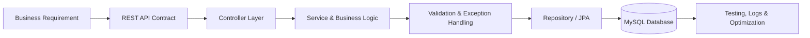

[Dhanashri4422_Premium_README.md](https://github.com/user-attachments/files/30000400/Dhanashri4422_Premium_README.md)
<!--
  GitHub Profile README for Dhanashri Gajare
  Repository: Dhanashri4422/Dhanashri4422
-->

 

  

---

## 👩‍💻 About Me

I am a **Java Backend Developer with 2+ years of professional experience** designing, developing, and maintaining backend applications using **Java, Spring Boot, Spring MVC, Hibernate, JPA, REST APIs, and MySQL**.

My work focuses on translating business requirements into dependable backend services, implementing validation and business logic, managing persistence layers, optimizing SQL operations, and troubleshooting production issues through logs and structured debugging.

- 💼 **Current role:** Jr. Web Developer at Southco, Inc.
- 🧱 **Architecture:** Controller–Service–Repository, MVC, and layered architecture
- 🔌 **Backend focus:** REST API design, business logic, validation, and integrations
- 🗄️ **Data layer:** Hibernate, JPA, MySQL, transaction management, and SQL optimization
- 🛠️ **Engineering mindset:** Reliability, maintainability, clean code, and production stability
- 🌱 **Currently strengthening:** System design, automated testing, CI/CD, and modern Spring practices
- 🤝 **Career interest:** Java backend engineering and collaborative software projects

---

## 🎯 Recruiter Snapshot

<table>
  <tr>
    <td><b>Experience</b></td>
    <td>2+ years in backend application development</td>
  </tr>
  <tr>
    <td><b>Primary Stack</b></td>
    <td>Java, Spring Boot, Hibernate/JPA, REST APIs, MySQL</td>
  </tr>
  <tr>
    <td><b>Professional Strengths</b></td>
    <td>API development, business logic, debugging, database operations, production support</td>
  </tr>
  <tr>
    <td><b>Development Style</b></td>
    <td>Layered architecture, reusable services, validation, exception handling, clean Git workflows</td>
  </tr>
  <tr>
    <td><b>Location</b></td>
    <td>Pune, Maharashtra, India</td>
  </tr>
</table>

---

## 🚀 What I Bring to a Development Team

<table>
  <tr>
    <td width="50%" valign="top">
      <h3>⚙️ Backend Engineering</h3>
      Build maintainable Java and Spring Boot services with clear separation of concerns and reusable business logic.
    </td>
    <td width="50%" valign="top">
      <h3>🔌 API Development</h3>
      Design RESTful endpoints, validation workflows, request/response models, and frontend integration contracts.
    </td>
  </tr>
  <tr>
    <td width="50%" valign="top">
      <h3>🗄️ Data & Transactions</h3>
      Work with Hibernate, JPA, MySQL, query optimization, and transaction consistency for reliable data operations.
    </td>
    <td width="50%" valign="top">
      <h3>🛡️ Production Reliability</h3>
      Investigate logs, debug application issues, improve error handling, and support stable production services.
    </td>
  </tr>
</table>

---

## 🧰 Technology Stack

### Core Development

### Backend, Database & Web

---

## 💼 Professional Experience

### Jr. Web Developer — Southco, Inc.
**July 2024 – Present · Pune, India**

- Develop and maintain backend services using **Java and Spring Boot**.
- Design and implement **RESTful APIs** for frontend integration and internal business modules.
- Implement business logic, validation rules, and API request/response workflows.
- Manage database operations using **Hibernate and JPA**.
- Optimize SQL queries and persistence operations for performance and reliability.
- Investigate production issues through application logs and structured debugging.
- Collaborate through Git-based development, peer review, and controlled code changes.

---

## 📌 Featured Backend Projects

<table>
  <tr>
    <td width="50%" valign="top">
      <h3>💰 Payroll Management System</h3>
      
<b>Java · Spring Boot · Hibernate · MySQL · REST APIs</b>

      <ul>
        <li>Designed backend workflows for salary, tax, and employee-benefit processing.</li>
        <li>Implemented CRUD operations and payroll calculation logic.</li>
        <li>Created REST endpoints for payroll processing and employee records.</li>
        <li>Structured the application using Controller, Service, and Repository layers.</li>
      </ul>
    </td>
    <td width="50%" valign="top">
      <h3>💳 Transaction Management System</h3>
      
<b>Spring Boot · Hibernate · MySQL · Transaction Management</b>

      <ul>
        <li>Developed APIs for deposits, withdrawals, and fund transfers.</li>
        <li>Implemented validation and centralized exception handling.</li>
        <li>Applied Spring transaction management for data consistency.</li>
        <li>Designed clear service and persistence-layer responsibilities.</li>
      </ul>
    </td>
  </tr>
</table>

---

## 🏗️ How I Structure Backend Solutions

---

## 🧠 Core Engineering Competencies

`Object-Oriented Programming` · `Java Collections` · `Exception Handling`  
`REST API Design` · `Layered Architecture` · `MVC Architecture`  
`Transaction Management` · `Database Integration` · `SQL Optimization`  
`Debugging` · `Production Support` · `Git Collaboration`

---

## 📊 GitHub Analytics

<picture>
  <source media="(prefers-color-scheme: dark)" srcset="https://github-readme-stats.vercel.app/api?username=Dhanashri4422&show_icons=true&theme=tokyonight&hide_border=true&rank_icon=github" />
  <source media="(prefers-color-scheme: light)" srcset="https://github-readme-stats.vercel.app/api?username=Dhanashri4422&show_icons=true&theme=default&hide_border=true&rank_icon=github" />
  
</picture>

<picture>
  <source media="(prefers-color-scheme: dark)" srcset="https://streak-stats.demolab.com?user=Dhanashri4422&theme=tokyonight&hide_border=true" />
  <source media="(prefers-color-scheme: light)" srcset="https://streak-stats.demolab.com?user=Dhanashri4422&theme=default&hide_border=true" />
  
</picture>

 

<picture>
  <source media="(prefers-color-scheme: dark)" srcset="https://github-readme-stats.vercel.app/api/top-langs/?username=Dhanashri4422&layout=compact&theme=tokyonight&hide_border=true&langs_count=8&size_weight=0.5&count_weight=0.5" />
  <source media="(prefers-color-scheme: light)" srcset="https://github-readme-stats.vercel.app/api/top-langs/?username=Dhanashri4422&layout=compact&theme=default&hide_border=true&langs_count=8&size_weight=0.5&count_weight=0.5" />
  
</picture>

---

## 📈 Contribution Activity

<picture>
  <source media="(prefers-color-scheme: dark)" srcset="https://github-readme-activity-graph.vercel.app/graph?username=Dhanashri4422&theme=tokyo-night&hide_border=true&area=true" />
  <source media="(prefers-color-scheme: light)" srcset="https://github-readme-activity-graph.vercel.app/graph?username=Dhanashri4422&theme=github-light&hide_border=true&area=true" />
  
</picture>

---

## 🐍 Contribution Animation

<picture>
  <source media="(prefers-color-scheme: dark)" srcset="https://raw.githubusercontent.com/Dhanashri4422/Dhanashri4422/output/github-contribution-grid-snake-dark.svg" />
  <source media="(prefers-color-scheme: light)" srcset="https://raw.githubusercontent.com/Dhanashri4422/Dhanashri4422/output/github-contribution-grid-snake.svg" />
  
</picture>

---

## 🎓 Education & Certification

- 🎓 **B.E. in Computer Engineering** — JSPM Imperial College of Engineering and Research, 2020–2024
- 📊 **CGPA:** 7.91
- 📜 **Java Full Stack Certification** — Fusion Software Institute

---

## 🤝 Let’s Connect

I enjoy building backend services that are reliable, maintainable, and easy for teams to extend.

  

<b>Building dependable backend systems, one clean API at a time.</b>

