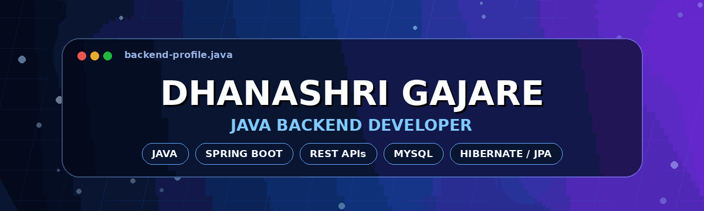
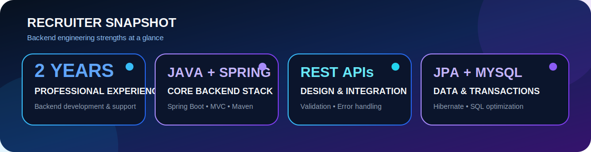
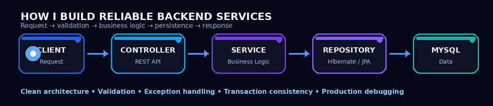

<!--
IMPORTANT:
1. This file must be named exactly README.md.
2. Keep it in the root of Dhanashri4422/Dhanashri4422.
3. Do not upload this Markdown file as an attachment inside another README.
-->

  

  

  
  
  
  

 

  

## 👩‍💻 About Me

I am a **Java Backend Developer with 2 years of professional experience** developing and supporting backend applications using **Java, Spring Boot, Spring MVC, Hibernate, JPA, REST APIs, and MySQL**.

I focus on converting business requirements into maintainable backend services, implementing business logic and validation, managing persistence layers, optimizing database operations, and resolving production issues through logs and structured debugging.

- 💼 Working as a **Jr. Web Developer at Southco, Inc.**
- ⚙️ Developing backend services and RESTful APIs using **Java and Spring Boot**
- 🧱 Applying **Controller–Service–Repository** and layered architecture
- 🗄️ Working with **Hibernate, JPA, MySQL, transactions, and SQL optimization**
- 🛠️ Supporting application stability through debugging and production issue analysis
- 🌱 Strengthening my skills in **system design, automated testing, and CI/CD**

---

## 🏗️ Backend Engineering Workflow

  

---

## 🧰 Technology Stack

### Backend & Database

  

### Tools & Web

  

---

## 💼 Professional Experience

### Jr. Web Developer — Southco, Inc.
**July 2024 – Present · Pune, India**

- Develop and maintain backend services using **Java and Spring Boot**.
- Design and implement **RESTful APIs** for frontend integration and internal modules.
- Implement business logic, validation rules, and API request/response workflows.
- Manage persistence operations using **Hibernate and JPA**.
- Optimize SQL queries and database operations for performance and reliability.
- Investigate production issues through application logs and structured debugging.
- Collaborate through Git-based version control and code review workflows.

---

## 🚀 Featured Backend Projects

<table>
<tr>
<td width="50%" valign="top">

### 💰 Payroll Management System

**Java · Spring Boot · Hibernate · MySQL · REST APIs**

- Developed backend workflows for employee salary, tax, and benefit processing.
- Implemented CRUD operations and payroll calculation logic.
- Designed REST APIs for payroll processing.
- Applied Controller, Service, and Repository layers.

</td>
<td width="50%" valign="top">

### 💳 Transaction Management System

**Spring Boot · Hibernate · MySQL**

- Developed APIs for deposits, withdrawals, and transfers.
- Implemented validation and exception handling.
- Applied Spring transaction management for consistency.
- Structured clear service and persistence responsibilities.

</td>
</tr>
</table>

---

## 🧠 Core Engineering Competencies

`Object-Oriented Programming` · `Java Collections` · `Exception Handling`  
`REST API Design` · `Layered Architecture` · `MVC Architecture`  
`Transaction Management` · `Database Integration` · `SQL Optimization`  
`Debugging` · `Production Support` · `Git Collaboration`

---

## 🔥 GitHub Contribution Streak

  <picture>
    <source media="(prefers-color-scheme: dark)" srcset="https://streak-stats.demolab.com?user=Dhanashri4422&theme=tokyonight&hide_border=true&border_radius=14" />
    <source media="(prefers-color-scheme: light)" srcset="https://streak-stats.demolab.com?user=Dhanashri4422&theme=default&hide_border=true&border_radius=14" />
    
  </picture>

## 📈 Contribution Activity

  <picture>
    <source media="(prefers-color-scheme: dark)" srcset="https://github-readme-activity-graph.vercel.app/graph?username=Dhanashri4422&theme=tokyo-night&hide_border=true&area=true&radius=14&custom_title=Dhanashri%20Gajare%27s%20Contribution%20Activity" />
    <source media="(prefers-color-scheme: light)" srcset="https://github-readme-activity-graph.vercel.app/graph?username=Dhanashri4422&theme=github-light&hide_border=true&area=true&radius=14&custom_title=Dhanashri%20Gajare%27s%20Contribution%20Activity" />
    
  </picture>

## 🐍 Contribution Animation

  <picture>
    <source media="(prefers-color-scheme: dark)" srcset="https://raw.githubusercontent.com/Dhanashri4422/Dhanashri4422/output/github-contribution-grid-snake-dark.svg" />
    <source media="(prefers-color-scheme: light)" srcset="https://raw.githubusercontent.com/Dhanashri4422/Dhanashri4422/output/github-contribution-grid-snake.svg" />
    
  </picture>

---

## 🎓 Education & Certification

- 🎓 **B.E. in Computer Engineering** — JSPM Imperial College of Engineering and Research, 2020–2024
- 📊 **CGPA:** 7.91
- 📜 **Java Full Stack Certification** — Fusion Software Institute

---

## 🤝 Let’s Connect

  I enjoy building backend services that are reliable, maintainable, and easy for development teams to extend.

  
  

  

